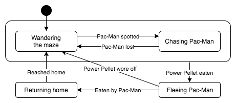

jStately
========

By Brandon Rich

jStately is a state machine written in Java. There are a few graphic tools out
there that can churn out generated state machine code in a variety of languages
including Java. But the goal of jStately is to allow developers to "hand craft"
maintainable, readable state graphs in an object-oriented way.

It was written with OOD principles and extensibility in mind. Users build
`StateGraph`s made up primarily of `State`s and `Transition`s, implementing
methods for events like entering a state, exiting a state or following a
transition. jStately relies heavily on interfaces but also provides sensible
default implementations. For example, a user could implement a `Transition`
that determines whether it is valid for a given input based on arbitrary
business logic. But the provided `EqualityTransition` implementation will
appeal to users whose transitions are based simply on whether an input is equal
to a particular expected value.

Although jStately does not aim to implement a particular defintion of a state
machine, features from common definitions are present. For example, a
`CompositeState` defines a collection of states and/or nested
`CompositeState`s, similar to hierarchical nested states in UML.
Composite states can have their own entry and exit behavior, as well as
transitions that are evaluated while the machine is in any contained state.

Example 
-------

The example below implements a state graph that models the behavior of the
ghost characters in the classic video game Pac-Man. For those not familiar with
the game, a brief summary can be found on
[Wikipedia](https://en.wikipedia.org/wiki/Pac-Man#Gameplay). A simplified
diagram of a ghost's behavior might look like this:

 

Its implementation using jStately might look something like this:

```java
public class GhostStateGraph extends StateGraph<GameEvent> {
    public GhostStateGraph() {
        State<GameEvent> wanderingState = new DefaultState<>("Wandering maze");
        State<GameEvent> chasingState = new DefaultState<>("Chasing Pac-Man");
        State<GameEvent> fleeingState = new DefaultState<>("Fleeing Pac-Man");
        State<GameEvent> returningHomeState = new DefaultState<>("Returning home");

        setStartState(wanderingState);

        addTransition(wanderingState, new EqualityTransition<>(chasingState, GameEvent.PACMAN_SPOTTED));
        addTransition(chasingState, new EqualityTransition<>(wanderingState, GameEvent.PACMAN_LOST));
        addTransition(fleeingState, new EqualityTransition<>(wanderingState, GameEvent.POWER_PELLET_WORE_OFF));
        addTransition(fleeingState, new EqualityTransition<GameEvent>(returningHomeState, GameEvent.GHOST_EATEN));
        addTransition(returningHomeState, new EqualityTransition<>(wanderingState, GameEvent.GHOST_REACHED_HOME));

        new CompositeState<>(null, wanderingState, chasingState)
                .addTransition(new EqualityTransition<>(fleeingState, GameEvent.POWER_PELLET_EATEN));
    }
} 
```

A `StateGraph` defines the relationship between its states but it is a
`StateMachine` that _has_ state and evaluates inputs in order to traverse the
graph. To use the graph defined above, a `StateMachine` could be initialized
with this code:

```java
StateMachine<GameEvent, GameEvent> machine = new StateMachine<>(
        new GhostStateGraph(),
        new DefaultInputAdapter<GameEvent>());
machine.start();
```

As the game continues and it is determined that important things have happened
(i.e., things that may or may not cause the machine to transition states,
according to our graph,) an event can be evaluated by the machine with a call
to `machine.evaluateInput(GameEvent.PACMAN_SPOTTED)`.

But a graph with no behavior isn't all that interesting. Suppose that a
developer wants certain things to happen as the machine transitions between
states. One such example might be rendering a ghost in blue while fleeing
Pac-Man. To do that, a developer might define the "fleeing" state like this:

```java
new DefaultState<GameEvent>("Fleeing Pac-Man") {
    @Override
    public void onEnter() {
        changeGhostColorToBlue();
    }

    @Override
    public void onExit() {
        restoreOriginalGhostColor();
    }
};
```

Alternatively, those same methods (`changeGhostColorToBlue()` and
`restoreOriginalGhostColor()`) could be called from the transitions leading
to and from `fleeingState`, like so:

```java
new EqualityTransition<GameEvent>(fleeingState, GameEvent.POWER_PELLET_EATEN) {
    @Override
    public void onTransition(GameEvent gameEvent) {
        changeGhostColorToBlue();
    }
}
```

Submachine States
-----------------

Sometimes it's useful to define a graph that is reused within another graph. In
these cases, a `SubmachineState` can be used. A submachine state is initialized
with a graph that has the same input type as its parent graph. When a state
machine enters a submachine state, it creates a new state machine internally
and future `evaluateInput()` calls are delegated to the child state machine
until it reaches a special `State` subclass – `FinalState`. When that happens,
the value returned by the final state's `getResult()` method is evaluated as an
input to the parent state machine, allowing it to transition out of the
submachine state.

There is no set limit on how deeply nested state graphs can be using
`SubmachineState`.
